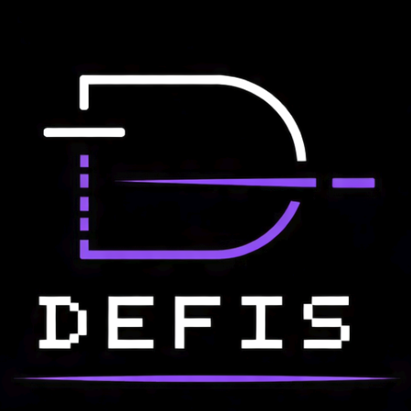
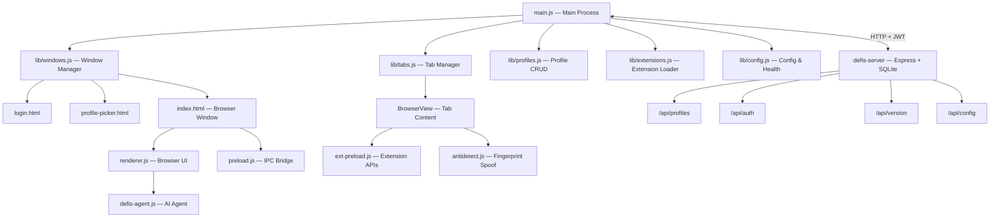

<div align="center">
  <br />
  
  <br /><br />

  <h1>DEFIS Browser</h1>

  <p><strong>Multi-profile anti-detection browser with built-in AI agent automation</strong></p>

  <p>
    <a href="#-features">Features</a> ·
    <a href="#-quick-start">Quick Start</a> ·
    <a href="#-ai-agent">AI Agent</a> ·
    <a href="#-chrome-extensions">Extensions</a> ·
    <a href="docs/">Docs</a>
  </p>

  <br />

  <a href="CHANGELOG.md"></a>
  
  
  
  
  

  <br /><br />

</div>

---

## Overview

DEFIS is a desktop browser built for teams and power users who need **complete profile isolation**, **anti-fingerprinting**, and **AI-powered automation** in a single tool.

Each profile runs in a fully isolated Chromium partition with its own cookies, localStorage, IndexedDB, proxy, and randomised fingerprint. A built-in AI agent (Claude or Gemini) can autonomously navigate pages, extract data, fill forms, and execute multi-step workflows — all from a natural-language prompt. Profiles, bookmarks, notes, and history sync to a self-hosted backend.

---

## ✦ Features

<table>
<tr>
<td valign="top" width="50%">

### 🛡️ Profile Isolation
Complete Chromium partition isolation per profile — separate cookies, storage, cache, and network stack. Zero cross-profile leakage regardless of how many profiles run simultaneously.

</td>
<td valign="top" width="50%">

### 🎭 Anti-Detection
User-Agent, Canvas, WebGL, AudioContext, timezone, and language fingerprint randomisation injected at the lowest level. Unique fingerprint generated per profile on creation.

</td>
</tr>
<tr>
<td valign="top" width="50%">

### 🤖 AI Agent
Claude or Gemini autonomously operates the browser via screenshot understanding, element interaction, form filling, and data scraping — directed by plain natural-language prompts.

</td>
<td valign="top" width="50%">

### 🔌 Chrome Extensions
Full CRX3 loading with Manifest V2/V3 support. Real popup `BrowserWindow`s, background service workers, `chrome.tabs` / `chrome.windows` / `chrome.storage` / `chrome.notifications` APIs.

</td>
</tr>
<tr>
<td valign="top" width="50%">

### 🌐 Proxy Management
Per-profile HTTP and SOCKS5 proxy with authentication. The proxy is bound to the profile partition — it never leaks across sessions or tabs.

</td>
<td valign="top" width="50%">

### ☁️ Server Sync
Profiles, bookmarks, notes, and browse history sync to a self-hosted Express + SQLite backend. Graceful offline fallback: the app works with a single local profile when the server is unreachable.

</td>
</tr>
<tr>
<td valign="top" width="50%">

### 📝 Rich Notepad
Per-profile rich-text notes with inline images and one-click public sharing via server-generated links.

</td>
<td valign="top" width="50%">

### ⚡ Productivity
Drag-and-drop tab reordering, tab detach to new window, profile quick-switch (`Ctrl+Shift+←/→`), find-in-page, and a full download manager.

</td>
</tr>
</table>

---

## 🏛️ Architecture



> **Process model:** Electron main process owns windows, tabs, profiles, and extensions. The renderer communicates exclusively through `preload.js` context bridge. Each tab's `BrowserView` gets its own `ext-preload.js` and `antidetect.js` injected before page load.

→ Deep dive: [docs/ARCHITECTURE.md](docs/ARCHITECTURE.md)

---

## ⚡ Quick Start

### Prerequisites

- **Node.js** 18 or later
- **npm** 8 or later
- Wine (only required for Windows cross-builds on Linux)

### 1. Start the backend server

```bash
cd page/defis-server
npm install
npm start
# → Listening on http://127.0.0.1:3717
# → Default credentials printed to console on first run
```

### 2. Launch the Electron app

```bash
cd page
npm install
npm start
```

### 3. Log in

Use the credentials printed by the server on first run.
To connect to a remote server, click **"Змінити сервер"** on the login screen and enter the URL.

---

## 🤖 AI Agent

DEFIS ships a built-in autonomous browser agent powered by **Claude** (Anthropic) or **Gemini** (Google).

### Setup

Open **Settings → Agent** and configure:

| Field | Description |
|-------|-------------|
| Provider | `anthropic` or `gemini` |
| API Key | Your Anthropic or Google AI API key |
| Model | e.g. `claude-sonnet-4-6`, `gemini-2.0-flash` |

### Agent Tools

| Tool | Description |
|------|-------------|
| `screenshot` | Captures the visible viewport (JPEG, max 1280 px) |
| `click` | Clicks an element by CSS selector or `[x, y]` coords |
| `type` | Types text into the focused element |
| `navigate` | Loads a URL in the active tab |
| `getDOM` | Returns a structured DOM snapshot (max 10 KB) |
| `scroll` | Scrolls the page or a specific element |
| `wait` | Waits for a CSS selector to appear in the DOM |
| `evaluate` | Executes arbitrary JavaScript and returns the result |

### Example Prompt

> *"Go to github.com, search for 'electron browser', open the first repository, and return its description, star count, and latest release version."*

The agent captures a screenshot, reasons about what it sees, calls the appropriate tools in sequence, and streams its thinking back to the UI.

→ Full reference: [docs/AGENT.md](docs/AGENT.md)

---

## 🔌 Chrome Extensions

Extensions are loaded from `<userData>/defis-extensions/`. Place an extracted (unzipped) CRX3 directory there and reload from the **Extensions** menu.

### What's Supported

| Feature | Status |
|---------|--------|
| Manifest V2 | ✅ Full support |
| Manifest V3 | ✅ Full support |
| Background service workers | ✅ Via BroadcastChannel bridge |
| Popup windows | ✅ Real `BrowserWindow` (not a new tab) |
| `chrome.tabs.sendMessage` | ✅ |
| `chrome.windows.create` | ✅ |
| `chrome.storage.local / sync` | ✅ |
| `chrome.notifications` | ✅ → Native OS notifications |
| Content scripts | ✅ Full message passing |
| i18n (`_locales/`) | ✅ |
| `chrome.identity` / OAuth | ⚠️ Partial |
| Native messaging | ❌ Not supported |

→ Implementation details: [docs/EXTENSIONS.md](docs/EXTENSIONS.md)

---

## ⌨️ Keyboard Shortcuts

| Shortcut | Action |
|----------|--------|
| `Ctrl+T` | New tab |
| `Ctrl+W` | Close current tab |
| `Ctrl+Tab` | Next tab |
| `Ctrl+Shift+Tab` | Previous tab |
| `Ctrl+L` | Focus address bar |
| `Ctrl+R` | Reload page |
| `Ctrl+Shift+R` | Hard reload (bypass cache) |
| `Ctrl+F` | Find in page |
| `Ctrl+Shift+A` | Open profile switcher |
| `Ctrl+Shift+←` | Switch to previous profile |
| `Ctrl+Shift+→` | Switch to next profile |
| `Ctrl+Shift+C` | Open claude.ai |
| `Alt+←` | Navigate back |
| `Alt+→` | Navigate forward |
| `F11` | Toggle fullscreen |

---

## 🏗️ Building & Releasing

DEFIS uses a single script that bumps the version, builds all targets, and deploys to the update server automatically.

### Setup (one-time)

```bash
cp page/.release-env.example page/.release-env
# Fill in DEFIS_SERVER_URL, DEFIS_ADMIN_EMAIL, DEFIS_ADMIN_PASS
```

### Release Commands

```bash
cd page

./release.sh                         # Bump patch (1.0.3 → 1.0.4), build, deploy
./release.sh 1.2.0                   # Explicit version
./release.sh 1.2.0 --no-upload       # Build only, skip deploy
./release.sh 1.2.0 --notes "Fix X"   # Add release notes
./release.sh 1.2.0 --force           # Block users on older versions
```

### Build Targets

| Command | Output |
|---------|--------|
| `npm run build:linux` | `.AppImage` |
| `npm run build:arch` | Arch Linux `.pkg.tar.zst` |
| `npm run build:win` | Windows NSIS `.exe` |
| `npm run build:all` | All of the above |

→ Full guide: [docs/BUILD.md](docs/BUILD.md)

---

## 📁 Project Structure

```
DEFIS/
├── page/                         # Electron application
│   ├── main.js                   # App bootstrap & IPC registration
│   ├── renderer.js               # Browser UI (tabs, address bar, menus)
│   ├── index.html                # Main browser window shell
│   ├── preload.js                # Context bridge: renderer ↔ main
│   ├── ext-preload.js            # Extension isolation & Chrome API bridge
│   ├── content-api-polyfill.js   # chrome.runtime polyfill for content scripts
│   ├── antidetect.js             # Canvas / WebGL / Audio fingerprint spoof
│   ├── defis-agent.js            # Claude / Gemini AI agent
│   ├── api-client.js             # HTTP client with JWT auth
│   ├── lib/
│   │   ├── tabs.js               # BrowserView lifecycle & IPC
│   │   ├── windows.js            # Window creation & management
│   │   ├── profiles.js           # Profile CRUD & IPC handlers
│   │   ├── extensions.js         # CRX3 extraction, MV2/V3 runtime
│   │   ├── config.js             # Global config, server health check
│   │   ├── proxy.js              # Per-profile proxy configuration
│   │   ├── cookies.js            # Cookie import / export
│   │   └── downloads.js          # Download manager
│   ├── login.html                # Authentication screen
│   ├── profile-picker.html       # Profile selection dialog
│   ├── setings.html              # Settings window
│   ├── release.sh                # Build + deploy automation
│   ├── .release-env.example      # Credentials template (copy → .release-env)
│   └── defis-server/             # Express backend
│       ├── server.js             # App bootstrap, CORS, rate limiting
│       ├── db.js                 # SQLite schema & all queries
│       ├── auth.js               # JWT helpers
│       └── routes/
│           ├── auth.js           # POST /api/login, /api/register
│           ├── profiles.js       # GET/POST/PUT/DELETE /api/profiles
│           ├── bookmarks.js      # Bookmark sync
│           ├── notes.js          # Notes sync
│           ├── history.js        # Browse history
│           ├── config.js         # Global config API
│           ├── version.js        # Update check & file download
│           └── admin.js          # Version uploads & management
└── docs/
    ├── ARCHITECTURE.md
    ├── AGENT.md
    ├── EXTENSIONS.md
    ├── ANTIDETECT.md
    ├── SERVER.md
    └── BUILD.md
```

---

## 📚 Documentation

| Document | Description |
|----------|-------------|
| [Architecture](docs/ARCHITECTURE.md) | Process model, IPC flow, data flow diagrams |
| [AI Agent](docs/AGENT.md) | Tool reference, configuration, prompt examples |
| [Extensions](docs/EXTENSIONS.md) | Chrome extension loading, API support matrix |
| [Anti-Detection](docs/ANTIDETECT.md) | Fingerprint spoofing techniques and coverage |
| [Server](docs/SERVER.md) | Backend setup, REST API reference, database schema |
| [Build & Release](docs/BUILD.md) | Building installers, release automation, update server |

---

## ⚙️ Environment Variables

| Variable | Default | Description |
|----------|---------|-------------|
| `DEFIS_PORT` | `3717` | Backend server port |
| `DEFIS_DB` | `defis.db` | SQLite database file path |
| `DEFIS_ORIGINS` | — | Extra CORS origins (comma-separated) |

**Auto-generated files** (all gitignored):

| File | Description |
|------|-------------|
| `page/server-config.json` | Saved server URL and JWT token |
| `page/defis-server/.admin-credentials` | Initial admin login |
| `page/.release-env` | Release script credentials |

---

## ⚖️ License

Proprietary software — © DEFIS Team. All rights reserved.

Licensing inquiries: [support@defis.app](mailto:support@defis.app)

---

<div align="center">
  <br />
  <strong>DEFIS Browser</strong> &nbsp;·&nbsp; Built on Electron, powered by Claude AI.
  <br /><br />
  <a href="mailto:support@defis.app">support@defis.app</a>
</div>
